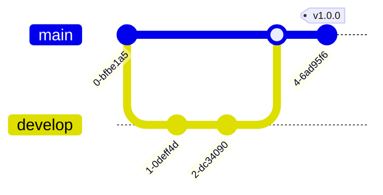
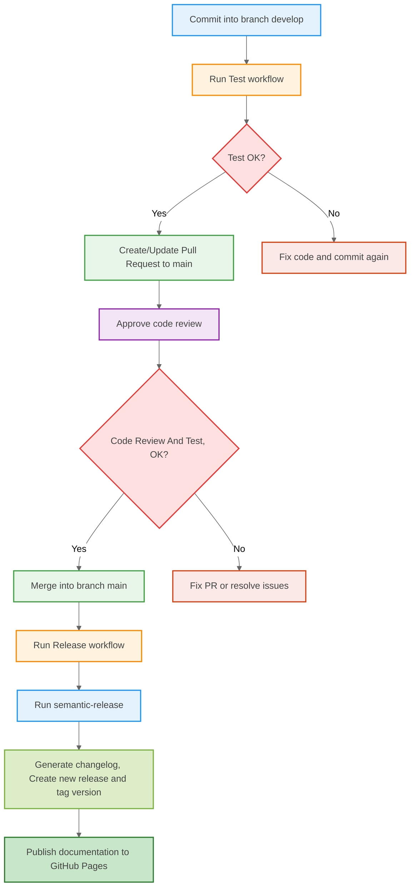

<div id="top" align="center" style="text-align:center;">
<h1>
  <br> 📦 TypeScript Library Template

  [![CodeQL][url-codeql-badge]][url-codeql]
  [![Test][url-test-badge]][url-test]
  [![Coverage][url-coverage-badge]][url-coverage-report]
  [![Release][url-release-badge]][url-release]

  
  
  
  
  [](./LICENSE)
  <a href="https://navto.me/heliomarpm" target="_blank"></a>

</h1>

<div class="badges">

  [![PayPal][url-paypal-badge]][url-paypal]
  [![Ko-fi][url-kofi-badge]][url-kofi]
  [![Liberapay][url-liberapay-badge]][url-liberapay]
  [![GitHub Sponsors][url-github-sponsors-badge]][url-github-sponsors]
  
</div>
</div>

## 📚 Summary

**Professional TypeScript Library template** with CI/CD-enabled, versioning with Semantic Release and Typedoc+VitePress documentation.

## 🔀 PR Workflow



## 🧩 What's Included

<!-- 🔳☑️ -->

**Core Infrastructure**
- ☑️ Node.js + TypeScript
- ☑️ Vitest (Unit Testing)
- ☑️ Semantic Release
- ☑️ GitHub Actions CI/CD 
- ☑️ GitHub Actions GitHub Pages
- ☑️ Automated NPM/GPR Publishing

**Quality Assurance**
- ☑️ BiomeJS (Linting/Formatting)
- ☑️ Husky + Lint Staged
- ☑️ Commitlint + Conventional Commits
- ☑️ CodeQL Scanning

**Project Scaffolding**
- ☑️ Docs: Contribution Guide & Code of Conduct
- ☑️ Husky Git Hooks
- ☑️ Automated CHANGELOG.md with Semantic Release
- ☑️ TypeDoc + Vitepress for Documentation Site

### ❓ When to Use This Template

Perfect for developers who need:

1. **Zero-config** TypeScript library setup
2. **Automated docs** with TypeDoc
3. **CI/CD pipeline** with GitHub Actions
4. **Semantic versioning** right out of the box

### 💡 Ideal for:

- Building npm packages
- Open source projects
- Enterprise-grade libraries

---
## 🤖 Automation Workflows

Workflow | Description | Trigger
:-- | :-- | :--
`0.test.yml` | Runs unit tests | Push/PR to `main` or `develop`
`1.create-pr.yml` | Creates or updates a pull request from `develop` to `main` | Push to `develop`
`2.deploy-docs.yml` | Deploys documentation and coverage badge | After a successful release 
`3.release.yml` | Generates changelog, tags, and releases | Push to `main`
`4.publish-npm.yml` | Publishes package to npm | After a successful release

<details>
<summary>Show full workflow</summary>



</details>

---
## 🚀 Quick Start

```bash
npx degit heliomarpm/tslib-template your-lib
cd your-lib
npm install
```
### 🛠️ Initial Setup
1. Replace template info:
   - Update `name` and `description` in `package.json`
   - Set version to `0.0.0` in `package.json`
   - Replace all references to `tslib-template` and `heliomarpm` in `package.json` and `README.md`
   - Delete `CHANGELOG.md`

2. Configure GitHub repository:
   - Enable GitHub Actions (Settings → Actions → General)
   - Set up branch protection rules (optional)
   - Configure GitHub Pages for documentation:
     1. Go to `Settings` → `Pages`
     2. In the `Build and deployment` section, under **Source**, select `Deploy from a branch`
     3. Choose the `gh-pages` branch and the `/ (root)` directory
     4. Save the changes
     5. Access the public URL displayed on the same page to confirm the deployment
   - Remove `if false` from `publish-npm.yml`
   - Generate [npm authentication token](https://docs.npmjs.com/creating-and-viewing-access-tokens) and copy it.
   - [Navigate to your GitHub repository page, click Settings and then Secrets. Click on New repository secret, fill in `NPM_TOKEN` as the Name, paste the npm token created on the previous step inside the Value field and hit Add secret.

---
## 📈 Semantic Versioning

This template uses [semantic-release](https://semantic-release.gitbook.io/) for automated version management and package publishing. Version numbers are determined automatically based on commit messages:

| Commit Message               | Release Type | Example Version |
| :--------------------------- | :----------- | :-------------- |
| `revert(scope): message`     | Patch        | 1.0.1           |
| `fix(scope): message`        | Patch        | 1.0.1           |
| `feat(scope): message`       | Minor        | 1.1.0           |
| `BREAKING CHANGE: message`   | Major        | 2.0.0           |

### 📝 Commit Message Format

```bash
<type>(<scope>): <short summary>
│       │             │
│       │             └─⫸ Summary in present tense. Not capitalized. No period at the end.
│       │
│       └─⫸ Commit Scope: core|docs|config|cli|etc.
│
└─⫸ Commit Type: fix|feat|build|chore|ci|docs|style|refactor|perf|test
```

When a commit is pushed to `main` branch:
1. semantic-release analyzes commit messages
2. Determines the next version number
3. Generates changelog
4. Creates a git tag
5. Publishes the release to GitHub

> **Note**: To trigger a release, commits must follow the [Conventional Commits](https://www.conventionalcommits.org/) specification.

---
## 📦 Project Scripts

* `npm run lint` — run linter and fixer
* `npm run format` — run formatter
* `npm run test` — run unit tests
* `npm run test:c` — run unit tests with coverage
* `npm run commit` - run conventional commits check
* `npm run release:test` — dry run semantic release 
* `npm run docs:dev` — run documentation locally
* `npm run docs` — build documentation and deploy


### Generate Documentation Page

see [TypeDoc Vitepress](https://www.typedoc-plugin-markdown.org/plugins/vitepress/quick-start)

- First time: `npx vitepress init` 
- Documentation code base: `npm run docs` or `npm run docs:dev`	

---
## ⚙️ Configuration Guide

### 🔐 Workflow permissions

For GitHub Actions workflows to create, edit, and manage **Pull Requests via API (GitHub CLI or REST)** and perform operations like push, release, and deploy, you need to configure the appropriate repository permissions.

1. Go to your repository's `Settings` → `Actions` → `General`
2. Go to section `Workflow permissions`
3. Set the permission level to `Read and write permissions`
4. Check on `Allow GitHub Actions to create and approve pull requests`
5. Click on **"Save changes"**

> By default, the GITHUB_TOKEN token used in actions has read-only permissions. Enabling Read and write permissions allows you to create PRs, edit PRs, commit changes, and create tags/releases programmatically.

<details>
<summary>📌 Configuration alternatives </summary>

**Replace the `GITHUB_TOKEN` with:**

<details>
<summary>🔐 Option 1 — Classic Personal Access Token (PAT)</summary>

✅ **Required permissions:**

* `repo` (for read and write access to repositories)
* `workflow` (for interacting with GitHub Actions)

✅ **Features:**

* A single token can be used in **any repository** of the same user or organization
* Cannot restrict granular access to specific repositories or permissions (full access within the configured scope)

✅ **How to use:**

1. Create a Classic PAT in:
   `GitHub Settings → Developer Settings → Personal access tokens → Tokens (classic)`

2. Enable the scopes:
   * `repo`
   * `workflow`

3. Save the token as a secret in the repository:
   * `Settings → Secrets and variables → Actions`
   * Suggested name: `PAT_TOKEN`

4. Reference in workflow:

```yaml
env:
  GITHUB_TOKEN: ${{ secrets.PAT_TOKEN }}
```
</details>

<details>
<summary>🔐 Option 2 — Fine-grained Personal Access Token (PAT)</summary>

✅ **Required permissions:**

* `Contents: Read and write`
* `Actions: Read and write`
* `Metadata: Read-only`
* (Optional) `Bypass branch protections` if you want to allow direct push even on protected branches

✅ **Features:**

* Allows you to restrict access to specific repositories at the time of creation
* Controls permissions with more granularity and security
* Needs to explicitly mark which repositories it will have access to
* Can be used in multiple repositories **if configured to allow access to those repositories during token creation** (either by selecting "All repositories" or manually selecting multiple)

✅ **How to use:**

1. Create a Fine-grained PAT in:
   `GitHub Settings → Developer Settings → Personal access tokens → Fine-grained tokens`

2. Set:
   * Repositories: select all required or check "All repositories"
   * Permissions:
     * `Contents: Read and write`
     * `Actions: Read and write`
     * `Metadata: Read-only`
     * (Optional) `Bypass branch protections`

3. Save the token as a secret in the repository:
   * `Settings → Secrets and variables → Actions`
   * Suggested name: `PAT_TOKEN`

4. Reference in workflow:

```yaml
env:
  GITHUB_TOKEN: ${{ secrets.PAT_TOKEN }}
```
</details>


#### 📌 Recommended Permissions Summary

| Operation                        | `GITHUB_TOKEN` (read/write) | Classic PAT | Fine-grained PAT   |
| :------------------------------- | :-------------------------- | :---------- | :----------------- |
| Create/Edit Pull Request         | ✅                           | ✅           | ✅ (`Contents: RW`) |
| Commit files to repository       | ✅ (if no branch protection) | ✅           | ✅                  |
| Create releases and tags via API | ✅                           | ✅           | ✅                  |
| Bypass branch protection         | ❌                           | ❌           | ✅ (if enabled)     |

> ⚠️ **Note:**\
> The built-in `GITHUB_TOKEN` in Actions respects all b>ranch protection rules, which prevents direct pushes to main if branch protection is configured.
> 
> Using a PAT or adjusting branch protection are the recommended solutions when automations require higher permissions.
> 
> For security, it is best to use **Fine-grained PATs** whenever possible, with specific permissions for the repositories and actions required.


</details>

---
## 📦 Dependencies

✅ Zero runtime dependencies \
🔄 All devDependencies are pinned to latest stable versions


## 🤝 Contributing

We welcome contributions! Please read:

- [Code of Conduct](docs/CODE_OF_CONDUCT.md)
- [Contributing Guide](docs/CONTRIBUTING.md)

Thank you to everyone who has already contributed to the project!

<a href="https://github.com/heliomarpm/tslib-template/graphs/contributors" target="_blank">
  <!--  -->
  
</a>

<!-- ###### Made with [contrib.rocks](https://contrib.rocks). -->
###### Made with [contrib.nn](https://contrib.nn.ci).

### ❤️ Support this project

If this project helped you in any way, there are several ways to contribute. \
Help us maintain and improve this template:

⭐ Starring the repository \
🐞 Reporting bugs \
💡 Suggest features \
🧾 Improving the documentation \
📢 Share with others

💵 Supporting via GitHub Sponsors, Ko-fi, Paypal or Liberapay, you decide. 😉

<div class="badges">

  [![PayPal][url-paypal-badge]][url-paypal]
  [![Ko-fi][url-kofi-badge]][url-kofi]
  [![Liberapay][url-liberapay-badge]][url-liberapay]
  [![GitHub Sponsors][url-github-sponsors-badge]][url-github-sponsors]

</div>

## 📝 License

[MIT © Heliomar P. Marques](LICENSE)  <a href="#top">🔝</a>

----
<!-- Sponsor badges -->
[url-paypal-badge]: https://img.shields.io/badge/donate%20on-paypal-1C1E26?style=for-the-badge&labelColor=1C1E26&color=0475fe
[url-paypal]: https://bit.ly/paypal-sponsor-heliomarpm

[url-kofi-badge]: https://img.shields.io/badge/kofi-1C1E26?style=for-the-badge&labelColor=1C1E26&color=ff5f5f
[url-kofi]: https://ko-fi.com/heliomarpm

[url-liberapay-badge]: https://img.shields.io/badge/liberapay-1C1E26?style=for-the-badge&labelColor=1C1E26&color=f6c915
[url-liberapay]: https://liberapay.com/heliomarpm

[url-github-sponsors-badge]: https://img.shields.io/badge/GitHub%20-Sponsor-1C1E26?style=for-the-badge&labelColor=1C1E26&color=db61a2
[url-github-sponsors]: https://github.com/sponsors/heliomarpm

<!-- GitHub Actions badges -->
[url-test-badge]: https://github.com/heliomarpm/tslib-template/actions/workflows/0.test.yml/badge.svg
[url-test]: https://github.com/heliomarpm/tslib-template/actions/workflows/0.test.yml
[url-coverage-badge2]: https://img.shields.io/badge/coverage-dynamic.svg?label=coverage&color=informational&style=flat&logo=jest&query=$.coverage&url=https://heliomarpm.github.io/tslib-template/coverage-badge.json
[url-coverage-badge]: https://img.shields.io/endpoint?url=https://heliomarpm.github.io/tslib-template/coverage/coverage-badge.json
[url-coverage-report]: https://heliomarpm.github.io/tslib-template/coverage

<!-- https://img.shields.io/endpoint?url=https://heliomarpm.github.io/tslib-template/coverage-badge.json&label=coverage&suffix=%25 -->

[url-release-badge]: https://github.com/heliomarpm/tslib-template/actions/workflows/3.release.yml/badge.svg
[url-release]: https://github.com/heliomarpm/tslib-template/actions/workflows/3.release.yml

[url-codeql-badge]: https://github.com/heliomarpm/tslib-template/actions/workflows/codeql.yml/badge.svg 
[url-codeql]: https://github.com/heliomarpm/tslib-template/security/code-scanning
